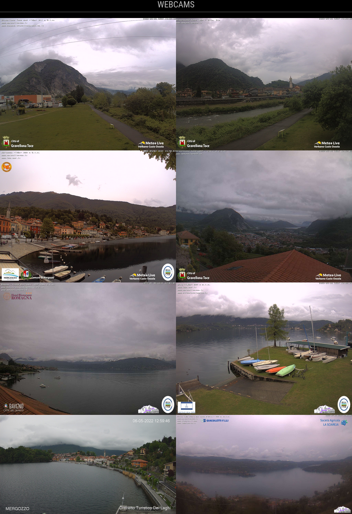

# MMM-OnlineImagesViewer
This is a module for the [MagicMirror](https://github.com/MichMich/MagicMirror).

- it shows images from a given list of online URLs
- it updates the images every given amount of time
- it allows to show a single image (also randomly selected) or a grid of images

It can be used for example to show webcam images.



## Installation
1. Clone this repository inside your MagicMirror's `modules` folder
```
cd ~/MagicMirror/modules
git clone https://github.com/NicholasRasi/MMM-OnlineImagesViewer.git
```

## Config
The entry in `config.js` can include the following options:


| Option             | Description | Type | Default
|--------------------|-------------| ---- | -------
| `opacity`          | The opacity of the image | float | 1.0
| `animationSpeed`   | Fade out and fade in images duration | number | 500 ms
| `updateInterval`   | Update interval time | number | 5000 ms
| `maxWidth`         | Value for maximum width. Optional, possible values: absolute (e.g. "700px") or relative ("50%") | string | "100%"
| `maxHeight`        | Value for maximum height. Optional, possible values: absolute (e.g. "400px") or relative ("70%") | string | "100%"
| `showAll`          | If true all images will be shown, otherwise only a single image will be displayed | boolean | true
| `random`           | Set if the images are shown in random order | boolean | false
| `numColumns`       | Number of columns | number | 3


Here is an example of an entry in `config.js`
```
{
	module: "MMM-OnlineImagesViewer",
	position: "top center",
	header: "Webcams",
	config: {
		images: [
			"https://www.meteolivevco.it/webcam/Gravellona-sud.jpg",
			"https://www.meteolivevco.it/httpdocs/it/images/cam/gravellonatoce.jpg"
		],
		random: false,
		updateInterval: 60 * 5 * 1000, // every 5 mins
		showAll: true,
		maxWidth: "300px",
		numColumns: 2
	}
},
```
